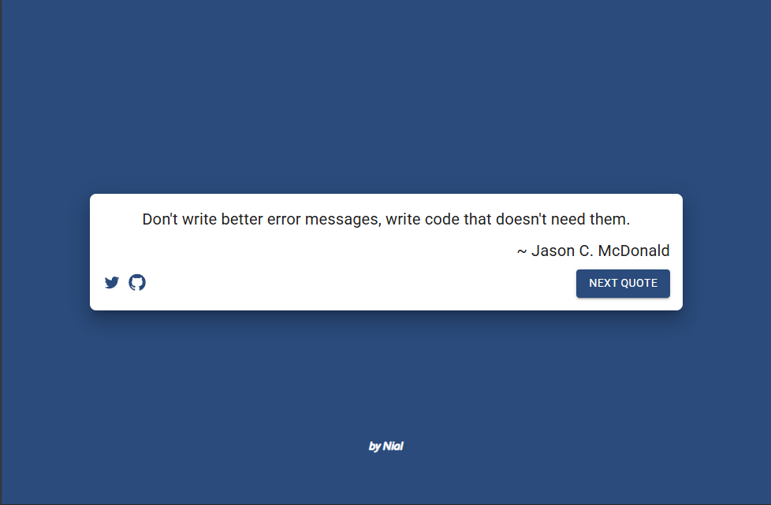

# Inspire Random Quote Machine

**Inspire Random Quote Machine** is a fun and interactive React application that generates random programming quotes from famous programmers. Each quote is displayed with a different randomly selected color scheme and font, adding an extra layer of creativity and inspiration to your coding experience.

## Features

- **Random Programming Quotes**: Get inspired by quotes from famous programmers.
- **Dynamic Styling**: Each quote is displayed with a randomly selected color scheme and font.
- **Responsive Design**: Works seamlessly on both desktop and mobile devices.
- **Simple and Easy to Use**: Just click the button to generate a new quote.

## Technologies Used

- React
- JavaScript (ES6+)
- CSS
- HTML

## Installation

1. Clone the repository:
   ```bash
   git clone https://github.com/nhope123/inspire.git
2. Navigate to the project directory:
   ```bash
    cd inspire
3. Install dependencies:
   ```bash
   npm install
4. Start the development server:
   ```bash
   npm start
5. Open the app in your browser:
   - http://localhost:3000
## 📸 Screenshots


## License
This project is licensed under the MIT License - see the [LICENSE](LICENSE.md) file for details.

## Acknowledgements
- Quotes sourced from various famous programmers.
- Random color and font generators inspired by online resources.

